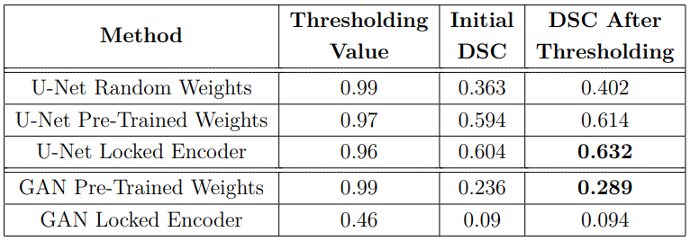

# Segmentation of Multiple Sclerosis lesions With Transfer Learning

This project focused on automatic segmentation of Multiple Sclerosis (MS) lesions on MRI images of brain. We tested the latest methods of segmentation using Deep Neural Networks and compared the approaches of weight initialization by transfer learning and self-supervised learning. The whole work can be found [here](https://dspace.vutbr.cz/handle/11012/196900?locale-attribute=en).

## Motivation

The automatic segmentation of MS lesions is a very challenging task, primarily due to the high imbalance of the dataset (brain scans usually contain only a small amount of damaged tissue, as seen on picture below). Due to this, researchers propose various approaches to improve the diagnostic process such as the usage of Deep Neural Networks.

    
    

    Fig.1: MRI of a patient with Multiple Sclerosis (left), with corresponding annotated white matter lesions (right).
    

 

---

## Datasets

Three public datasets were gathered. Together they consisted of 55 scans with manually annotated lesions by medical experts and 31 scans without annotations, used for testing. Datasets:

- MSSEG 2016 Grand Challenge,
- IACL 2015 Longitudinal MS Segmentation,
- MICCAI 2008 MS Segmentation Challenge.

## Preprocessing the scans

The mentioned datasets varied in format of scans (conversion to NifTI from RAW was necessary), had different resolutions (resizing voxels to isotropic size) and one of them included the skull ([Brain Extraction Tool](https://fsl.fmrib.ox.ac.uk/fsl/fslwiki/BET) was used for skull stripping). T1, T2 and FLAIR sequences were chosen for research since all the datasets contained them.

    
    

    Fig.2: Differences among MRI sequences.
    

Before passing the scans to the input of neural network, the scans were divided into train, validation and test groups, where the latest mentioned included only the brain scans, without annotated corresponding masks. The 3D images were transformed by 2D axial cuts along the z-axis to be transformed to 2D. After this step, the lists were converted to a Numpy array.

    
    

    Fig.3: Process of loading data for input before training.
    

Since the pixel values might have varied due to different scanners, the data in arrays
were normalized. This was done by dividing each value of an array by the maximum
value of the array, which resulted in every value being in a range [0, 1].

The Generator incorporated [ImageDataAugmentor](https://github.com/mjkvaak/ImageDataAugmentor) to apply augmentations (Vertical Flip, Random Rotate 90°, Shift Scale Rotate, Grid Disortion).

> It was crucial that the library modified the brain and corresponding mask the same way, in order to match annotations with damaged brain tissue.

 

## U-Net Training:

The first architecture which was used was a 2D U-Net build by [ Segmentation Models](https://github.com/qubvel/segmentation_models) library. Source of pre-trained weights was ImageNet dataset. This dataset is part of an ImageNet project and contains 150,000 photographs. Its function is to detect the object and classify it into one of 1,000 different categories.

We tested the U-Net model with a ResNet-34 backbone, with three different settings
of encoder weights:

- randomly initialized weights,
- pre-trained weights,
- pre-trained weights, which are locked during the training.

### U-Net Hyperparameters

- **Optimizer**: Adam
- **Learning Rate**: 2𝑒−5
- **Loss Function**: Binary Crossentropy
- **Metrics**: Combo Loss
- **Steps Per Epoch**: 128
- **Validation Steps**: 24
- **Batch Size**: 32
- **Epochs**: 300

 

## GAN Training:

GAN training was divided into two stages for the purpose of transfer learning. The first stage aimed to pre-train weights of the GAN generator on the whole dataset. The second stage used a filtered dataset with only FLAIR modality and loaded pre-trained weights from the first stage to encoder to later adapt them for MS segmentation challenge.

The pre-training code was based on [Pix2Pix](https://github.com/phillipi/pix2pix). We implemented self-supervised learning, specifically context encoder, which learned how to reconstruct brain scans from incomplete input. The input image was combined with a "checkerboard"; therefore, it had missing pieces in it (see Figure 4) that served as an input seed.

    
    

    Fig.4: GAN pre-training: a) epoch number 10, b) epoch number 8,000.
    

The second stage of GAN training used the generator, along with pre-trained
weights from the first stage, to perform transfer learning.

### GAN Hyperparameters

The generator part had encoder-decoder architecture and was used for both pretraining and later transfer learning. The only difference was changing the output activation function in the second stage to sigmoid. Other hyperparameters stayed as in the first experiment.

## Technical parameters

All the experiments were conducted on a remote Linux server at the Brno University of Technology. The machine was equipped with 66 GB of RAM and a GeForce GTX 1080 Ti graphics card, which used CUDA 11.2 to speed up the training process. The size of the whole training dataset was 1.6 GB, with one brain scan varying from 10 to 40 MB.
The language used for work was Python 3.7.8, with all libraries isolated in one Conda environment.

Main libraries: **Tensorflow 1.14.0, Keras 2.3.1, Numpy 1.19.2, NiBabel 3.2.1, Segmentation Models 1.0.1, Albumentations 0.5.2, ImageDataAugmentor 0.2.8**.

---

## Results

The summary of all the results for individual methods is in Table 1. It is clear that pre-training weights with self-supervised learning by the GAN model did not improve the used metrics, and even after thresholding showed worse values of DSC.

    
    

    Tab.1: Comparison of Dice Similarity Coefficient values on training data for all proposed techniques.
    

There might be at least three possibilities of such a decrease in performance
compared to the first and second approach. One of them is batch normalization. Another one could be the difference in the implementation of our two architectures. Lastly, the problem might have been the difficulty of the MS segmentation task. The datasets were significantly imbalanced; hence the neural networks were not able to train properly.

In terms of the time difference, none of the experiments showed significant differences
in training time (approximately 3 hours) and prediction time (1 second for a patient).

> The whole comparison, as well as graphs of training and pictures of predicitons can be seen in the [full thesis](https://dspace.vutbr.cz/handle/11012/196900?locale-attribute=en).
